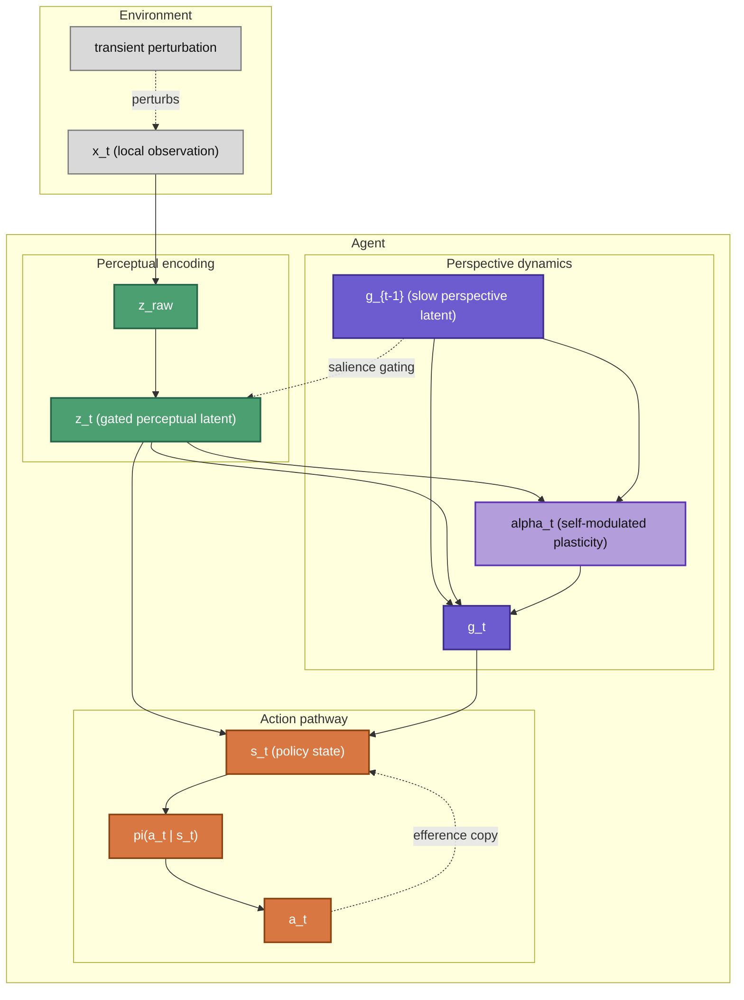
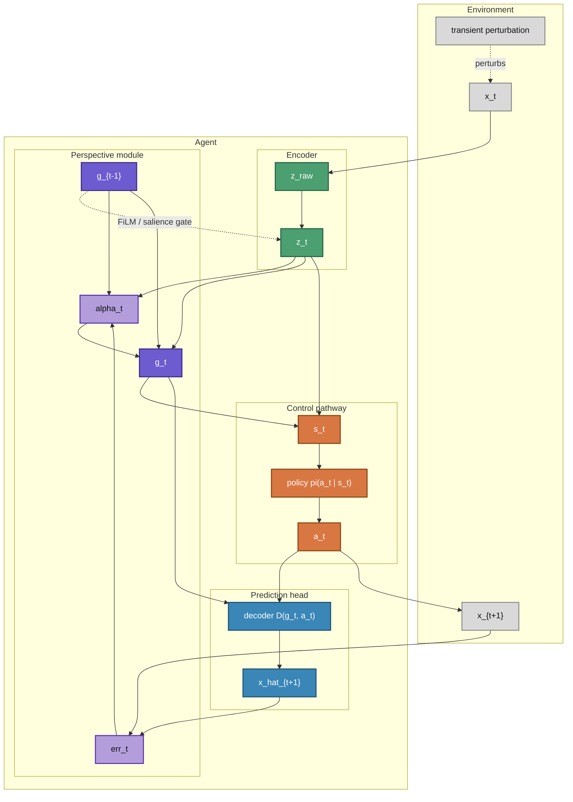

# perspective-agent-p2

## Vast.ai instance setup 

git config --global user.name "hjpae"  
git config --global user.email "hnjpae@gmail.com"  

ssh-keygen -t ed25519 -C "hnjpae@gmail.com"  
eval "$(ssh-agent -s)"  
ssh-add ~/.ssh/id_ed25519  
cat ~/.ssh/id_ed25519.pub  
ssh -T git@github.com  

git clone git@github.com:hjpae/perspective-agent-p2.git
cd perspective-agent-p2  
git remote -v  

git remote remove origin  
git remote add origin git@github.com:hjpae/perspective-agent-p2.git  

conda env create -f environment.yml  
conda activate cear-phase2  

## install dependencies (cuda 12.8 ... code is 13.1 compatible)  

conda env create -f environment.yml  
conda activate cear-phase2  

pip install --no-cache-dir torch torchvision torchaudio \  
  --index-url https://download.pytorch.org/whl/cu128  

python - <<'PY'  
import torch  
print(torch.__version__)  
print(torch.version.cuda)  
print(torch.cuda.is_available())  
if torch.cuda.is_available():  
    print(torch.cuda.get_device_name(0))  
PY  

## Usage  
run run_phase2.sh  
... phase1 runs should be specified  

## Mermaid Figures  

### Fig1. Semantic role only  

### Fig2. Full version

```mermaid
flowchart TD
  %% Environment
  subgraph ENV["Environment"]
    X["x_t (local observation)"]
    P["transient perturbation"]
  end

  %% Agent
  subgraph AG["Agent"]
    subgraph ENC["Perceptual encoding"]
      ZR["z_raw"]
      Z["z_t (gated perceptual latent)"]
    end

    subgraph PERS["Perspective dynamics"]
      G0["g_{t-1}<br/>(prior perspective)"]
      A["alpha_t (revision rate)"]
      G["g_t<br/>(updated perspective)"]
    end

    subgraph ACT["Action pathway"]
      S["s_t (policy state)"]
      POL["policy π(a_t | s_t)"]
      ACTN["a_t (action)"]
    end
  end

  %% Inputs
  X --> ZR
  P -. perturbs .-> X

  %% Salience gating (main contribution)
  G0 == salience gating ==> Z
  ZR --> Z

  %% Perspective update
  Z --> A
  G0 -- controls revision rate --> A
  G0 --> G
  Z --> G
  A --> G

  %% Action path
  Z --> S
  G --> S
  S --> POL --> ACTN
  ACTN -. embodied effect .-> X

  %% Efference copy / embodiment
  ACTN -. action trace (a_{t-1}) .-> S

  %% Styling
  classDef perspective fill:#6D5BD0,stroke:#3F2E8C,stroke-width:2px,color:#ffffff;
  classDef plasticity fill:#B39DDB,stroke:#5E35B1,stroke-width:2px,color:#111111;
  classDef policy fill:#D97742,stroke:#8B4513,stroke-width:2px,color:#ffffff;
  classDef percept fill:#4C9F70,stroke:#25664A,stroke-width:2px,color:#ffffff;
  classDef env fill:#D9D9D9,stroke:#7A7A7A,stroke-width:1.5px,color:#111111;

  class G0,G perspective;
  class A plasticity;
  class POL,ACTN,S policy;
  class ZR,Z percept;
  class X,P env;

  %% Emphasize the main gating edge
  linkStyle 2 stroke:#5A43B5,stroke-width:4px;
```

